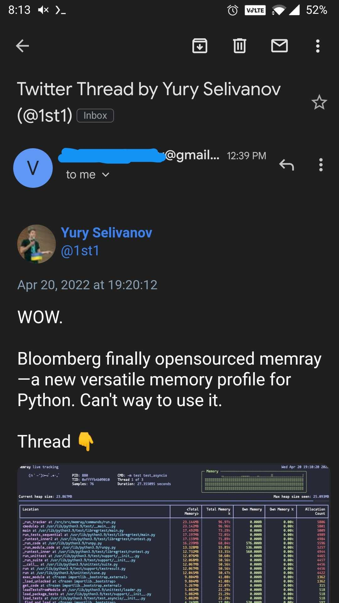

# archive-tweets-to-gmail
This repo has the code to archive twitter threads especially the bookmarks to gmail. It saves a static html with all images to gmail so even if the tweets are deleted from Twitter, the saved threads in gmail will be unaffected. Since Gmail does not support videos in its html, only videos are included as a link.

## How to run
- Clone the repo
- Install the dependencies `pip install snscrape requests`
- Get the bookmarks.json for your Twitter bookmarks and save it in the repo folder
  - This can be done using the Twitter API V2 but it takes a lot of effort (i.e. set up an app with OAuth etc.) so I used a quick and dirty way
  - Log into your Twitter account in Chrome and open developer tools
  - In developer tools, go to 'Network' tab
  - Bring up your bookmarks page and let it load
  - Look for 'bookmark.json?..' in the list of resources and save its content to `bookmarks.json` file in the repo folder
- Get the app password for the sender gmail account using the instructions in this Stackoverflow answer https://stackoverflow.com/a/73214197
- Make the following changes to the `main.py` file
  - update the `sender_email` and `receiver_email`
- Run `python main.py`
  
Here are a couple of screenshots of how the threads look -

- Mobile

- Web

## License
MIT License
